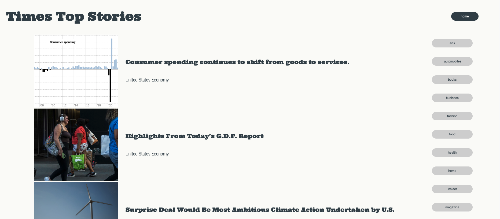
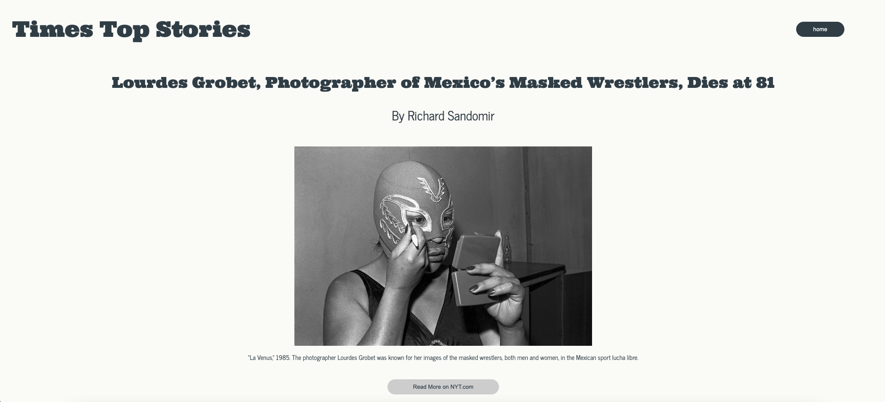

# Times Top Stories
By Stephanie Roe [GitHub](https://github.com/stephanie-roe) | [LinkedIn](https://www.linkedin.com/in/stephanie-j-roe/)

## Introduction
Times Top Stories is a Takehome Technical Challenge for the Turing School of Software and Design that consumes the New York Times Top Stories API and allows users to browse, filter and read articles in a simple, easy-to-use interface. 

## Technologies

## Set Up & Installation
- Fork and clone this repository. 
- Once cloned onto your machine, `cd` into the root directory. 
- Run `npm install` to ensure all dependencies are installed properly. 
- Run `npm start` to see the project in your browser. 
- Run `npm run cypress` to run the test suite. 
- Happy building! 

## Features
As a user, I am able to: 
- browse all top stories on the New York Times home page
- Filter top stories by section 
- See a signle article's details
- Visit the link for the article on the New York Times website
- Navigate back to the homepage from any user flow

## Execution 

## Extensions
- All user flows are tested and network requests are stubbed using Cypress E2E testing. 
- Application implements accessible design, with a Lighhouse Audit score of **100% in accessibility** and **92% in best practices**. 

## Future Extensions
- Addition of Responsive Design to enable access for mobile users

## Spec
The expectations for this take home challenge can be found [here](https://mod4.turing.edu/projects/take_home/take_home_fe) and [here](https://mod4.turing.edu/projects/take_home/take_home_rubric).

## Additional Resources
Documentation for the New York Times API can be found [here](https://developer.nytimes.com/docs/top-stories-product/1/overview).

The GitHub repo and project board for this challenge can be found [here](https://github.com/stephanie-roe/times-top-stories) and [here](https://github.com/users/stephanie-roe/projects/1/views/1).
